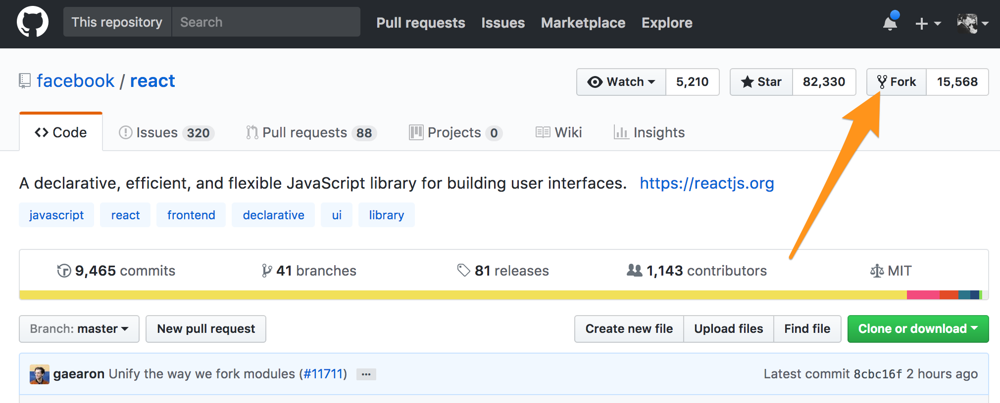

# Git: Forking a repository

> _Ah, the life! Branching, committing, pushing, pulling, merging... modifying code to my hearts' content... breathing life into features like some sort of magician or squashing bugs like an exterminator. Bliss. Until..._

```bash
! [remote rejected] master -> master (protected branch hook declined)
error: failed to push some refs to 'git@github.com:some-account/some-repo.git'
```

☹️

When working with code, there are times when you will want to modify code that resides in a repository that is not under your control, or with which for a variety of reasons you don't wish to interact. You might want to introduce features that are outside the scope of the project. You may want to build something completely unrelated and just use the repository as a starting point. Maybe a useful library needs a bug fix, but the maintainer has abandoned the repository. 

For all these times and [more](#why-fork), there's **Forking**!

## What is a Fork?

Forking is creating a new copy of the entire repository. This might sound like `git clone`, and behind the scenes it is. The difference is in where the new copy resides. A "clone" typically refers to a _local_ copy of some repository. A _fork_, in contrast, is a second *remote* repository distinct from the original that it copies.

Historically, a _fork_ was created when a developer or team wanted to take a project in a new direction, or carry on an original mission where the core project undergoes some major shift. Some examples of this are NodeJS and IO.js, or when the licensing changes to `OpenOffice` by Sun led to the LibreOffice fork, and ultimately OpenOffice's demise. These classic situations can be referred to as **hard forks**, where the forked code is not meant to be integrated back into the original (upstream) codebase. What we deal with most often are so called **soft forks**, where we _do_ intend for our changes to be integrated back into the original repository, and the fork is a convenient system for creating an isolated workspace. From here on when we say "fork" we will be talking about soft forks, unless explicitly stated otherwise.

## How do I make a fork?

You can do this manually by cloning a repository locally and then pushing to a new remote repository in a place of your choosing (GitHub, GitLab, BitBucket, etc). You would do so like this:
```bash
$> git clone git@github.com:some-account/some-repo.git
$> git remote add myfork git@github.com:fork-account/fork-repo.git
$> git push myfork master
```
Note: more about [managing `remote`s](#dealing-with-multiple-remotes) below.

GitHub and most other git-based version control services have forking built in as a feature that will automatically create a new repository under your account and copy the source repository into your new repository.

On GitHub, for example, this can be accomplished simply by clicking the "Fork" button in the top right corner, just under your account avatar. See here:


## Why would we want a fork?
### Why not just branch?

So far we have mostly discussed the reasons one may want or need to create a _hard_ fork of some project, where we intend on making permanently incompatible changes, but we have not justified our more typical (soft) fork situation. As you recall, this is for work which we want to eventually merge back into the main repository. Some reasons for doing this are:

* **User workspaces:** when projects involve a large number of developers (imagine a popular open source or large enterprise project), if each developer were pushing branches for their work the repository would become cluttered with many branches mostly of interest to only one person. When you are synchronizing your local instance, you have many more branches listed than you need because you may see branches for everybody's work.
* **Clean main repository:** as in the above case, but even for smaller teams, often the main repository is kept as the source-of-truth for the `master` (or `develop`) branch, and is otherwise reserve for CI and CD tasks, such as preserving production release versions. Branches for work-in-progress are relegated to user forks only in order to keep the central repo tidy.
* **Experimental changes:** Sometimes you need to make large architectural changes or adjust CI/CD configuration, and it isn't acceptable to block work on the main repo. Configuring another pipeline against a fork is one option to get around this.

## Dealing with multiple `remote`s
When you set up your local repository with multiple `remote` repositories (usually the main repository and your own fork), there are slight changes to some of the `git` commands you are accustomed to using. Specifically, for any commands that deal with remote repositories (`push`, `pull`, `fetch` etc), you now need to specify the repository with which you want to interact.

For the following examples, imagine you cloned from your fork, so the repo copy under your account is the remote named `origin`, and we've added a second remote called `upstream` for the main reposiory.

### `pull`
When pulling the latest changes for a tracked remote branch, you now specifiy the full source, including the remote name:
```shell
$> git pull upstream master
```

### `push`
Now when you push a branch, you will nee to specifiy the target remote by name:
```shell
$> git push origin my-cool-feature
```
A common workflow is to push your work-in-progress feature branches to your fork, and then issue a Pull Request from there back to the main repository.

### `fetch`
If you want to retrieve all of the latest changes from some remote (usually `upstream`), you can do so via `fetch`:
```shell
$> git fetch upstream
```

### `rebase`
_TBD_ - should we cover this?

## The Short Version
If your team uses forks as part of their flow, after get acess to the main repository you should do the following:
1) Create a personal fork of the repository on whichever platform the team uses.
1) Clone _your fork_ locally: `git clone git@github.com:your-account/shared-repo.git`
1) Add the main repository as another remote: `git remote add upstream git@github.com:repo-owner-account/shared-repo.git`
1) Checkout the `master` branch
1) Create a branch for your feature: `git checkout -b feat/my-cool-feature`
1) Develop! Commit! Get it to the point where you're ready to propose merging the code.
1) Get the latest code from the upstream repo (other code may have been merged): `git fetch upstream`
1) Rebase your branch against the latest version of `master` from `upstream`: `git rebase upstream/master`
  1) Follow the steps, being very carefully resolve any _merge conflicts_ if necessary.
1) Push your rebased branch to your o`rigin`: `

## Check your understanding

* How is a fork of a repository different than a clone?
* What are some reasons for forking?
* What do we mean by hard and soft forks?

## More resources

Some further reading

- [GitHub help article](https://help.github.com/articles/fork-a-repo/)
- [Atlassian's explanation](TODO)
- [Another perspective on forks](https://gregoryszorc.com/blog/2017/12/11/high-level-problems-with-git-and-how-to-fix-them/)
